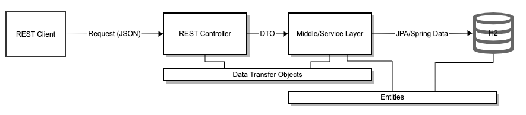

# Summary of solution
### Business Requirements (Minimum)  and related APIs
##### Register a car with its plate number
```sh
curl --location --request POST 'http://localhost:8080/cars' \
--header 'Content-Type: application/json' \
--data-raw '{"carNumberPlate":"ABCD3802","carType":"SEDAN","something":10}'
```
##### Register availability of a car from date/time, to date/time, rental price per hour
```sh
curl --location --request POST 'http://localhost:8080/cars/11/availibilities' \
--header 'Content-Type: application/json' \
--data-raw '{"currencyCode":"SEK","fromDateTime":"2020-09-25T06:00Z","perHourRate":4,"toDateTime":"2020-09-28T06:00Z"}'
```
##### Search for available cars to rent from date/time, to date/time, maximum rental price per hour
```sh
curl --location --request GET 'http://localhost:8080/cars/availibilities?fromDateTime=2020-09-27T06:00Z&perHourRate=10000000&toDateTime=2020-09-28T06:00Z'
```
##### Register a user (to rent a car)
```sh
curl --location --request POST 'http://localhost:8080/customers' \
--header 'Content-Type: application/json' \
--data-raw '{"firstName":"fn6441","lastname":"ln8752","email":"em_92494@assignment-xyz.com"}'
```
##### Book a car from date/time, to date/time, user id, car id
```sh
curl --location --request POST 'http://localhost:8080/cars/11/availibilities/11/order?custId=11' \
--header 'Content-Type: application/json' \
--data-raw '{"pickupTime":"2020-09-25T06:00Z","dropoffTime":"2020-09-28T06:00Z"}'
```
#### Report
###### Report of booked cars from date/time, to date/time
###### Report of number of booked cars per hour from date, to date
###### Report of total payment from date, to date
```java
curl --location --request GET 'http://localhost:8080/orders?pickupTime=2020-09-27T06:00Z&dropoffTime=2020-09-28T06:00Z'
```

### General Requirements
##### In addition to the backend, you should also implement a client application which simulates 5 users who register cars and get reports and 10 users who book cars. They should run until the client program is stopped.
`/car-rental-service/src/main/java/com/assignment/car/rental/TestClient.java runs on startup with 10 parallel threads to execute.`
```
I have put 100,000 iteration as limit. So test stops if shutdown or 100K iteration finished.
```
##### In the backend application, provide at least 1 system test case which should be run using a different maven profile.
`intTest profile is attached to integration tests. Need to execute command below to run. These tests are excluded from main build`

```sh
mvn verify -PintTest
```
##### The application should be able to handle concurrent requests while maintaining data integrity.
`Some testing has ensured this. Extensive testing`
##### It should handle exceptions and error cases gracefully.
`Known exceptions (unchecked) are handled in /car-rental-service/src/main/java/com/assignment/car/rental/exception/RestExceptionHandler.java`
##### You can choose any open source framework/server to help you run your application.
`Spring boot 2.3.4 is used`
##### You need to provide a simple documentation on your design and how to build, run tests and run and test the application.
###### Overall Design

##### To Build
```sh
mvn clean install
```
##### To run
```sh
mvn spring-boot:run 
or
java -jar target/car-rental-service-0.0.1-SNAPSHOT.jar
```
##### You should use Java (minimum version 8) and Maven 3+ for build.
`Java 11.0.3 and maven 3.6.3 are used`
##### You can send your code in a ZIP or host it on for example GitHub or GitLab or similar.
`Hosted on github at https://github.com/srjha/car-rental-service`
##### We should be able to build, run tests and run the application and test it without any changes or configuration needed.
```sh
mvn clean install
```
##### You should make the application executable using Maven.
```sh
mvn spring-boot:run 
```

## Additional information

##### H2 DB can be accessed while application is running on at URL http://localhost:8080/h2-console with following details
```sh
JDBC URI: jdbc:h2:mem:testdb
Username: sa
Password:
```
##### Data can be persisted in file system by following changes in /car-rental-service/src/main/resources/application.properties
```sh 
spring.datasource.url=jdbc:h2:file:/data/car-rental  
# spring.datasource.url=jdbc:h2:mem:testdb
```

## Testing Instruction (Local run only)
#### Swagger UI
`Once service is UP swagger UI can be used at http://localhost:8080/swagger-ui/`

#### Postman collection
```
Postman collection can be imported and used from testing/car-rental.postman_collection.json
```


## Future Enhancements
##### Pagination
Pagination and probably use of Hypermedia-Driven RESTful Web Service (hateoas) should be scoped.
##### CQRS/Event driven
Event driven approach can be discussed to facilitate more robust ecosystem as on when more of services are brought in
##### Build and deployment
Containerization and orchrastraction should be considered if more of related services are brought in.